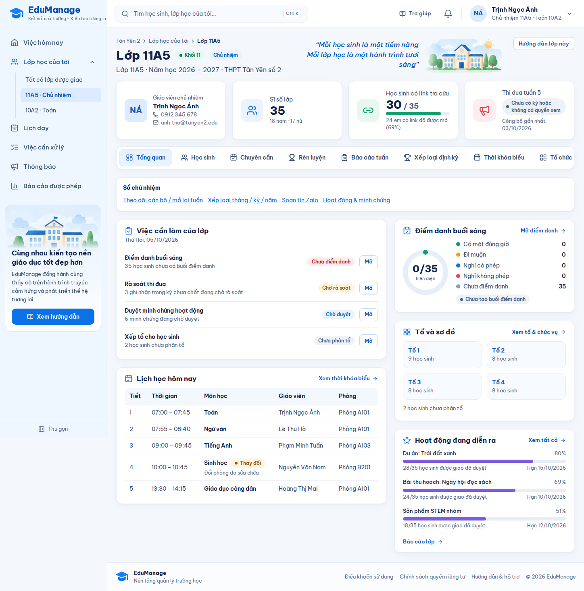
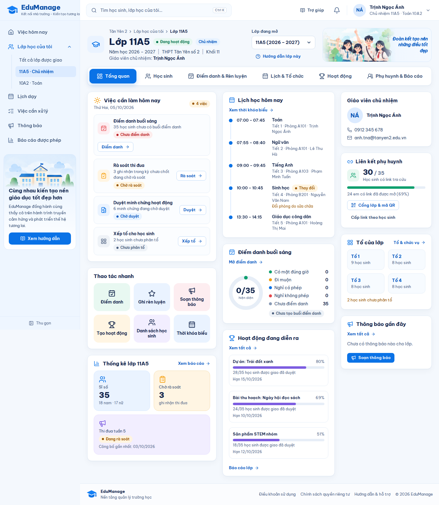
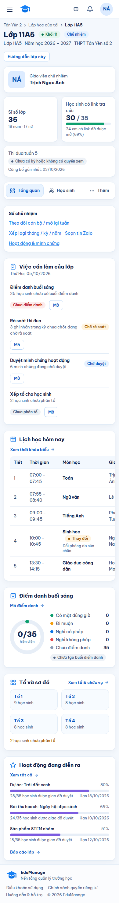
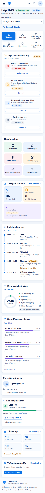

# Tài liệu review nghiệp vụ — Thiết kế lại "Lớp học của tôi"

| | |
|---|---|
| Phiên bản tài liệu | 1.0 — 07/10/2026 |
| Trạng thái | **Chờ BA review / UAT**. Image đã publish trong tag v1.0.11, **production chưa update** |
| Mã nguồn gốc | `f349150` (bản phát hành v1.0.10), nhánh `codex/new-machine-audit-20261002` |
| Phát hành | v1.0.11, chỉ thay đổi frontend |
| Tài liệu kỹ thuật kèm theo | [CLASS-WORKSPACE-REDESIGN.md](CLASS-WORKSPACE-REDESIGN.md) · [PRE-DEPLOY-LOP-HOC-CUA-TOI.md](PRE-DEPLOY-LOP-HOC-CUA-TOI.md) |
| Ảnh minh họa | `qa/screenshots/class-redesign/`, chỉ dùng dữ liệu giả |

BA cần làm 3 việc:
1. Đọc mục 1–6 (thay đổi và quy tắc).
2. Chạy kịch bản UAT ở mục 7 trên môi trường thử.
3. Trả lời các câu hỏi ở mục 8, sau đó ký duyệt ở mục 10.

---

## 1. Bối cảnh và mục tiêu

Giáo viên, nhất là người không rành công nghệ, đang gặp khó trong không gian lớp:

- **Quá nhiều tab trên một hàng.** Giáo viên chủ nhiệm có 16 tab ngang. Ở màn hình 1448px chỉ thấy khoảng 8 tab, nửa còn lại (Thông báo, Tệp lớp, Báo cáo, Cổng QR, Cài đặt lớp…) bị khuất bên phải. Trên điện thoại chỉ thấy 2 tab và nút "Thêm".
- **Nút hành động chung chung.** Mọi việc trong danh sách việc cần làm đều có nút "Mở", giáo viên không biết bấm vào sẽ làm gì.
- **Đầu trang chiếm nhiều chỗ.** Bốn thẻ số liệu ở đầu trang đẩy việc cần làm xuống dưới.
- **Lỗi hiển thị.** Khi tuần thi đua đang ở trạng thái "đang rà soát", thẻ số liệu lại hiện "Chưa có kỳ hoặc không có quyền xem".

**Mục tiêu:**
- Mở lớp là thấy ngay việc cần làm hôm nay, mỗi việc có nút làm ngay.
- Mọi chức năng của lớp nằm trong 6 mục, luôn nhìn thấy hết. Từ bất kỳ trang nào của lớp, tới được chức năng cần dùng trong tối đa 2 lần bấm.
- Không thay đổi nghiệp vụ, quyền hạn, dữ liệu hay API.

Căn cứ thiết kế: 6 màn mockup lớp 11A5 do chủ dự án gửi ngày 07/10/2026 (Tổng quan, Học sinh, Hoạt động, Lịch & Tổ chức, Điểm danh & Rèn luyện, Phụ huynh & Báo cáo).

## 2. Phạm vi

**Trong phạm vi:**
1. Điều hướng mới trong lớp: 6 mục, mỗi mục có mục con.
2. Đầu trang lớp mới: trạng thái lớp, giáo viên chủ nhiệm, ô chuyển lớp, ảnh banner kèm khẩu hiệu lớp.
3. Trang **Tổng quan** lớp làm lại.
4. Nút **Điểm danh nhanh** trên màn điểm danh.
5. Tour "Hướng dẫn lớp này" rút gọn.
6. Bố cục cho điện thoại và máy tính bảng.

**Ngoài phạm vi (không đổi):**
- Backend, API, cơ sở dữ liệu, migration, phân quyền phía server.
- Nội dung chi tiết bên trong các trang con: danh sách học sinh, thi đua, hoạt động, thông báo, báo cáo… vẫn giữ nguyên chức năng, chỉ đổi đầu trang và điều hướng.
- Không gian nhà trường, trang "Việc hôm nay" của giáo viên, cổng phụ huynh.

**Có trong mockup nhưng chưa làm:** xem mục 6.

## 3. Trước và sau

| | Trước | Sau |
|---|---|---|
| Máy tính, 1448px |  |  |
| Điện thoại, 390px |  |  |

Hai bộ ảnh trên dùng cùng một bộ dữ liệu giả lập kiểu lớp 11A5 để so sánh công bằng.

Ảnh khác:
- [Máy tính bảng 768px](../qa/screenshots/class-redesign/05-sau-tong-quan-768.png)
- [Tổng quan trên dữ liệu thật của môi trường thử](../qa/screenshots/class-redesign/19-tong-quan-du-lieu-that-1448.png)
- [Giáo viên bộ môn](../qa/screenshots/class-redesign/20-gvbm-tong-quan-1448.png)

Những thay đổi người dùng thấy ngay:

| # | Trước | Sau |
|---|---|---|
| 1 | Một hàng 16 tab phải cuộn ngang; điện thoại có 4 tab và nút "Thêm" | 6 mục luôn hiện đủ. Mở một mục thì các mục con hiện ngay bên dưới |
| 2 | "Việc cần làm của lớp" với nút "Mở" | "Việc cần làm hôm nay" với nút động từ: Điểm danh, Rà soát, Duyệt, Chốt tuần, Xếp tổ, Công bố |
| 3 | Thẻ "Sổ chủ nhiệm" chỉ là dòng chữ liên kết | Cán bộ lớp chưa nộp báo cáo tuần và hoạt động sắp đến hạn được đưa vào danh sách việc cần làm |
| 4 | Không có | Thẻ **Thao tác nhanh**: tối đa 6 ô lớn (Điểm danh, Ghi rèn luyện, Soạn thông báo, Tạo hoạt động, Danh sách học sinh, Thời khóa biểu…) |
| 5 | 4 thẻ số liệu nằm trên đầu trang | Chuyển thành thẻ "Thống kê lớp" và "Liên kết phụ huynh" ở thân trang. Sửa nhãn trạng thái tuần |
| 6 | Lịch học hôm nay dạng bảng | Dòng thời gian theo giờ. Tiết hủy bị gạch ngang, tiết đổi có nhãn "Thay đổi" kèm lý do |
| 7 | Không có | Thẻ **Thông báo gần đây**: 4 thông báo mới nhất, có nút Soạn thông báo |
| 8 | Muốn sang lớp khác phải quay về danh sách lớp | Ô **"Lớp đang mở"** trên đầu trang, chia nhóm Lớp chủ nhiệm / Lớp giảng dạy |
| 9 | Điểm danh phải chọn từng em, hoặc tick chọn rồi đổi hàng loạt | Nút **"Có mặt cho N em còn lại"** (xem BR-10) |
| 10 | Tour lớp 11 bước | Tour 6 bước. Giáo viên bộ môn có 5 bước vì không có bước "Chốt và công bố" |

## 4. Cấu trúc 6 mục và quyền hiển thị

### 4.1. Gom 16 tab cũ vào 6 mục

| Mục | Mục con | Tab cũ tương ứng | Quyền phía server cần có (chỉ cần một) |
|---|---|---|---|
| **Tổng quan** | — | Tổng quan | `class.read` |
| **Học sinh** | Danh sách | Học sinh | `student.read` |
| | Tổ & chức vụ | Tổ chức lớp | `group.manage` |
| | Sơ đồ chỗ ngồi | Sơ đồ lớp | `seating.manage` |
| **Điểm danh & Rèn luyện** | Điểm danh | Chuyên cần | `attendance.read`, `attendance.record` |
| | Rèn luyện tuần | Rèn luyện | `conduct.read`, `conduct.record`, `conduct.review`, `conduct.adjust.approve` |
| | Báo cáo tuần | Báo cáo tuần | `group.manage` |
| | Xếp loại định kỳ | Xếp loại định kỳ | `conduct.review`, `conduct.lock`, `conduct.publish` |
| **Lịch & Tổ chức** | Thời khóa biểu | Thời khóa biểu | `schedule.read` |
| | Trực nhật | Trực nhật | `duty.read`, `duty.manage` |
| | Cài đặt lớp | Cài đặt lớp | `group.manage` |
| **Hoạt động** | Hoạt động | Hoạt động & minh chứng | `activity.read/manage`, `evidence.read/manage` |
| | Minh chứng | (trang con của Hoạt động) | như trên, **cộng thêm** `evidence.manage` hoặc `report.read` |
| | Thông báo | Thông báo | `announcement.read`, `announcement.manage` |
| | Tệp lớp | Tệp lớp | `file.read`, `file.manage` |
| **Phụ huynh & Báo cáo** | Cổng lớp & mã QR | Cổng QR | `parent_access.manage` |
| | Báo cáo | Báo cáo | `report.read` |
| | Tin nhắn Zalo | (trang con của Báo cáo) | `report.read` **và** `guardian.read` |

Các trang sâu vẫn tô sáng đúng mục cha:
- Nội quy, Kết quả công bố, Điều chỉnh sau chốt, Rà soát & chốt tuần, Tổng hợp tuần → "Rèn luyện tuần".
- Chuyên cần theo tuần → "Điểm danh".
- Hồ sơ học sinh → "Danh sách".
- Tạo/sửa/xem hoạt động → "Hoạt động".
- Soạn/xem thông báo → "Thông báo".

### 4.2. Mục thực tế theo vai trò (lấy từ API của môi trường thử)

| Vai trò | Mục và mục con nhìn thấy |
|---|---|
| Giáo viên chủ nhiệm (10A1) | Đủ 6 mục và 18 mục con |
| Giáo viên bộ môn (10A2, môn Toán) | Tổng quan · Học sinh (Danh sách) · Điểm danh & Rèn luyện (Điểm danh, Rèn luyện tuần) · Lịch & Tổ chức (Thời khóa biểu) · Hoạt động (Hoạt động, Minh chứng, Thông báo, Tệp lớp) · Phụ huynh & Báo cáo (Báo cáo) |
| Quản trị trường xem lớp 10A1 | Đủ 6 mục, có nhãn "Xem theo quyền nhà trường", không có ô chuyển lớp |

## 5. Quy tắc nghiệp vụ (Business Rules)

| Mã | Quy tắc |
|---|---|
| BR-01 | Mục và mục con **chỉ hiện khi server trả về tab tương ứng** cho người dùng ở lớp đó. Việc gom nhóm không mở thêm quyền. Mục nào không còn mục con thì ẩn. |
| BR-02 | Bấm một mục sẽ mở mục con đầu tiên mà người dùng được phép xem. Mục chỉ có một mục con thì không hiện thanh mục con. |
| BR-03 | Mục và mục con đang chọn được xác định theo đường dẫn trang. Trang sâu tô sáng mục cha (xem 4.1). |
| BR-04 | Ô **"Lớp đang mở"** chỉ hiện với tài khoản giáo viên có từ 2 lớp đang dạy trở lên. Lớp được nhóm thành "Lớp chủ nhiệm" và "Lớp giảng dạy". Chọn lớp khác sẽ mở **Tổng quan** của lớp đó. Nếu trang đang có thay đổi chưa lưu, hệ thống hỏi "Bạn có thay đổi chưa lưu" trước khi chuyển. Trên điện thoại, ô này chỉ hiện ở các trang không có tiêu đề riêng (Tổng quan, Danh sách học sinh). |
| BR-05 | **Việc cần làm hôm nay** gồm 10 loại việc do server tính, cộng 2 tín hiệu sổ chủ nhiệm (xem bảng dưới). Mỗi việc có số lượng, nhãn trạng thái và đúng một nút. Không hiện khi lớp hoặc năm học đã lưu trữ hoặc ngoài thời gian học. Người không được cấp quyền thấy "Không có quyền xem phần này.". Không có việc nào thì hiện "Không có việc chờ xử lý trong phạm vi được cấp". |
| BR-06 | **Thao tác nhanh** hiện tối đa 6 ô theo thứ tự ưu tiên, mỗi ô chỉ hiện khi có quyền (bảng dưới). Năm học lưu trữ thì ẩn các ô ghi dữ liệu. |
| BR-07 | **Thống kê lớp** gồm: Sĩ số (nam/nữ), Chờ rà soát (số ghi nhận thi đua) và Thi đua tuần N. Trạng thái tuần: Đang ghi nhận / Đang rà soát / Đã chốt / Đã công bố. Chưa có kỳ hoặc không có quyền thì hiện "Chưa có kỳ hoặc không có quyền xem". Dữ liệu lấy từ đầu trang lớp, không gọi thêm API. |
| BR-08 | **Liên kết phụ huynh** chỉ hiện với người có quyền quản lý link tra cứu. Nội dung: số học sinh có link trên sĩ số, thanh tỉ lệ, số em đã mở link. Có hai nút: "Cổng lớp & mã QR" và "Cấp link theo học sinh". |
| BR-09 | **Thông báo gần đây** chỉ hiện khi có quyền đọc thông báo lớp. Hiển thị 4 thông báo mới nhất, sắp theo ngày công bố, nếu chưa có thì theo ngày đặt lịch, nếu chưa có nữa thì theo ngày cập nhật. Gồm thông báo của lớp ở mọi trạng thái, có nhãn trạng thái, **kể cả bản Nháp**, và thông báo đã công bố "Từ nhà trường". Nút "Soạn thông báo" chỉ hiện khi được phép soạn. *(Xem câu hỏi Q3.)* |
| BR-10 | **Điểm danh nhanh**: nút "Có mặt cho N em còn lại" chỉ hiện khi buổi đang được sửa và còn em "Chưa điểm danh". Khi bấm, **chỉ** các em "Chưa điểm danh" chuyển sang "Có mặt"; em đã có trạng thái giữ nguyên. Thay đổi chỉ nằm trong bản nháp: **không tự lưu, không tự công bố**. Giáo viên vẫn phải bấm "Lưu điểm danh" rồi "Công bố cho phụ huynh" như cũ. |
| BR-11 | **Lịch học hôm nay** chỉ hiện tiết đã công bố trong phạm vi được cấp. Tiết hủy gạch ngang và có nhãn "Đã hủy". Tiết thay đổi có nhãn "Thay đổi" kèm lý do. Thiếu số tiết, phòng hoặc tên giáo viên thì ghi rõ "Chưa ghi…". |
| BR-12 | Lỗi tải dữ liệu tổng quan chỉ hiện **một** khối lỗi có nút "Thử lại". Các thẻ lấy từ đầu trang (Giáo viên chủ nhiệm, Thống kê, Liên kết phụ huynh) vẫn hiển thị. |
| BR-13 | Lớp hoặc năm học đã lưu trữ hiện thẻ "Năm học hoặc lớp đã lưu trữ" kèm liên kết tra cứu lịch sử. Không hiện việc cần làm, lịch học hay điểm danh hôm nay. |
| BR-14 | Trên điện thoại (dưới 640px): ẩn đường dẫn (breadcrumb) và dòng giáo viên chủ nhiệm. 6 mục hiện dạng lưới 3 cột. Trang không được tràn ngang. |
| BR-15 | Tour "Hướng dẫn lớp này" có 6 bước: Lớp đang mở → Sáu mục của lớp → Việc cần làm hôm nay → Thao tác nhanh → Chốt và công bố → Hướng dẫn lớp này. Bước nào không có trên màn hình thì bỏ qua. Giáo viên bộ môn không có bước "Chốt và công bố". |
| BR-16 | Trang có tiêu đề riêng (ví dụ "Điểm danh") dùng tiêu đề đó làm tiêu đề chính. Tên lớp vẫn hiện phía trên. Mỗi trang có đúng một tiêu đề chính (h1). |

**Bảng việc cần làm (BR-05):**

| Loại | Tên việc | Nút | Mở tới |
|---|---|---|---|
| attendance | Điểm danh buổi sáng | Điểm danh | Điểm danh |
| attendance-finish | Hoàn tất điểm danh buổi sáng | Hoàn tất | Điểm danh |
| attendance-publish | Công bố chuyên cần hôm nay | Công bố | Điểm danh |
| lesson-attendance | Điểm danh các tiết của bạn | Điểm danh | Điểm danh |
| conduct-review | Rà soát thi đua | Rà soát | Rà soát & chốt tuần |
| conduct-lock | Chốt thi đua | Chốt tuần | Rèn luyện tuần |
| evidence | Duyệt minh chứng hoạt động | Duyệt | Minh chứng |
| adjustment | Điều chỉnh sau chốt | Duyệt | Điều chỉnh sau chốt |
| adjustment-publish | Công bố bản điều chỉnh | Công bố | Điều chỉnh sau chốt |
| groups | Xếp tổ cho học sinh | Xếp tổ | Tổ & chức vụ |
| (sổ chủ nhiệm) | Cán bộ lớp chưa nộp báo cáo tuần | Xem & nhắc | Báo cáo tuần |
| (sổ chủ nhiệm) | Hoạt động sắp đến hạn (trong 7 ngày hoặc quá hạn) | Xem | Hoạt động |

**Bảng thao tác nhanh (BR-06), theo thứ tự ưu tiên:**

| Ô | Điều kiện hiện | Ghi dữ liệu? |
|---|---|---|
| Điểm danh | có mục Điểm danh và quyền ghi điểm danh | có |
| Ghi rèn luyện | có mục Rèn luyện tuần và quyền ghi thi đua | có |
| Soạn thông báo | có mục Thông báo và quyền quản lý thông báo lớp | có |
| Tạo hoạt động | có mục Hoạt động và quyền quản lý hoạt động | có |
| Danh sách học sinh | có mục Danh sách | không |
| Thời khóa biểu | có mục Thời khóa biểu | không |
| Xuất báo cáo | có mục Báo cáo | không |
| Mã QR phụ huynh | có mục Cổng lớp & mã QR | không |
| Tin nhắn Zalo | có mục Báo cáo và quyền xem giám hộ | không |

## 6. Phần mockup chưa triển khai, và lý do

| Màn | Thành phần trong mockup | Tình trạng | Lý do / đề xuất |
|---|---|---|---|
| Tổng quan | "Hoạt động gần đây" (dòng nhật ký) | Chưa làm | Chưa có API nhật ký cấp lớp cho giáo viên. Tạm dùng thẻ Hoạt động đang diễn ra và Thông báo gần đây |
| Tổng quan | Ô tick trước từng việc cần làm | Không làm | Việc tự biến mất khi đã xử lý; tick tay dễ gây hiểu nhầm là đã xong |
| Tổng quan | Thẻ phụ huynh có mã QR và nút "Tải mã QR" | Thay bằng nút dẫn sang "Cổng lớp & mã QR" | Mã QR và quy tắc chia sẻ nằm ở trang Cổng lớp |
| Học sinh | Mục con "Phụ huynh" (danh sách phụ huynh của lớp và trạng thái liên kết) | Chưa làm | Chưa có API danh sách phụ huynh cấp lớp. Hiện cấp link theo từng học sinh trong Danh sách *(Q1)* |
| Học sinh | Thanh thao tác hàng loạt (Đặt vào tổ, Phân công chức vụ, **Tạo tài khoản PH**, Xóa) | Không làm | Nghiệp vụ không có tài khoản phụ huynh (BUSINESS-V2). Các thao tác khác vẫn ở trang Tổ & chức vụ |
| Lịch & Tổ chức | Mục con "Lịch lớp" (họp lớp, kiểm tra giữa kỳ…) | Chưa làm | Hệ thống chưa có tính năng sự kiện lớp *(Q2)* |
| Điểm danh & Rèn luyện | Chấm điểm rèn luyện tuần theo 4 tiêu chí; khối "Cần lưu ý"; thanh tiến trình Ghi nhận → Rà soát → Chốt → Công bố | Chưa làm | Hiện thi đua tính theo bộ nội quy của trường; 4 tiêu chí là mô hình chấm khác, cần BA quyết *(Q6)*. Quy trình rà soát/chốt/công bố đã có ở trang Rèn luyện tuần |
| Phụ huynh & Báo cáo | Danh sách phụ huynh với nút "Nhắn tin", "Gửi lại", "Mời liên kết" | Không làm | Nghiệp vụ không có chat hay tài khoản phụ huynh. Tin nhắn Zalo là soạn sẵn để giáo viên tự copy và gửi |
| Hoạt động / Lịch / Báo cáo | Bố cục chi tiết bên trong trang (biểu đồ tròn minh chứng, lưới thời khóa biểu…) | Giữ trang hiện có | Ngoài phạm vi đợt này; có thể làm tiếp theo từng màn |
| Mọi màn | Số liệu mẫu trong mockup | — | Mockup có số không thống nhất (sĩ số 75 / 35; liên kết 0/75 / 60/75 / 68; thứ trong tuần sai lịch). Hệ thống luôn dùng số thật từ server |

## 7. Kịch bản UAT

Môi trường thử local: http://localhost:24380
- Giáo viên chủ nhiệm 10A1, đồng thời dạy bộ môn 10A2: `teacher-a@example.invalid`
- Quản trị trường: `admin-a@example.invalid`
- Mật khẩu: nhờ dev cung cấp, không ghi trong tài liệu.

Dữ liệu thử:
- Lớp 10A1 có 20 học sinh, có ghi nhận thi đua chờ rà soát.
- Điểm danh hôm nay để trống có chủ ý.
- Thời khóa biểu chỉ có tiết từ 08/10 trở đi.

Cột "Dev" là kết quả dev đã tự kiểm:
- **Tự động**: script hoặc test chạy lại được.
- **Thật**: thao tác trên môi trường thử có API và PostgreSQL thật.
- **Hợp đồng**: test giao diện với API giả lập.

Cột "BA" để BA ghi kết quả.

| ID | Vai trò | Bước | Kết quả mong đợi | Dev | BA |
|---|---|---|---|---|---|
| UAT-01 | GVCN | Mở lớp 10A1 | 6 mục hiện đủ, "Tổng quan" đang chọn; không có tab nào bị khuất | Đạt (Thật, 1448 & 390px) | ☐ Đạt ☐ Không đạt |
| UAT-02 | GVCN | Bấm lần lượt 6 mục, rồi từng mục con | Mở đúng trang; mục và mục con đang chọn được tô sáng; danh sách mục con đúng bảng 4.1 | Đạt (Thật: 18/18 trang × 2 kích thước, không lỗi, không tràn ngang) | ☐ |
| UAT-03 | GVCN | Mở các trang sâu: Rà soát tuần, Tổng hợp tuần, Nội quy, Kết quả công bố, Điều chỉnh, Chuyên cần theo tuần, Tạo hoạt động, Soạn thông báo, Hồ sơ học sinh | Mục cha vẫn được tô sáng (BR-03); mỗi trang có một tiêu đề chính | Đạt (Thật, 9 trang) | ☐ |
| UAT-04 | GVBM (teacher-a ở 10A2) | Mở lớp 10A2 | Chỉ thấy mục và mục con theo bảng 4.2; mục chỉ có một mục con thì không có thanh mục con | Đạt (Thật) | ☐ |
| UAT-05 | Quản trị trường | Vào Danh sách lớp → 10A1 | Đường dẫn ghi "Danh sách lớp"; có nhãn "Xem theo quyền nhà trường"; không có ô "Lớp đang mở" | Đạt (Thật + Hợp đồng) | ☐ |
| UAT-06 | Người chỉ được cấp đọc lớp | Mở lớp | Chỉ thấy Tổng quan và các mục được cấp; không gọi danh bạ lớp của giáo viên | Đạt (Hợp đồng) | ☐ |
| UAT-07 | GVCN có 2 lớp | Ở trang Thời khóa biểu, chọn 10A2 trong ô "Lớp đang mở" | Ô chia nhóm "Lớp chủ nhiệm: 10A1" / "Lớp giảng dạy: 10A2"; mở Tổng quan lớp 10A2 | Đạt (Thật) | ☐ |
| UAT-08 | GVCN | Ở Điểm danh, đổi trạng thái 1 em (chưa lưu) rồi chọn lớp khác | Hiện hộp thoại "Bạn có thay đổi chưa lưu"; bấm "Ở lại" thì vẫn ở trang cũ, dữ liệu còn nguyên | Đạt (Thật) | ☐ |
| UAT-09 | Mọi vai trò | Mở trên điện thoại (390px) và máy tính bảng (768px) | 6 mục dạng lưới, chữ không bị cắt, trang không tràn ngang; đầu trang gọn (BR-14) | Đạt (Thật 390px; giả lập 768px) | ☐ |
| UAT-10 | GVCN | Ở Tổng quan, bấm nút của từng việc cần làm | Mỗi nút mở đúng trang theo bảng BR-05 | Đạt (Thật: Điểm danh, Rà soát, Xếp tổ) | ☐ |
| UAT-11 | GVBM 10A2 | Mở Tổng quan | Hiện "Không có việc chờ xử lý trong phạm vi được cấp" | Đạt (Thật) | ☐ |
| UAT-12 | Người không có quyền xem việc | Mở Tổng quan | Thẻ việc cần làm hiện "Không có quyền xem phần này." | Đạt (Hợp đồng) | ☐ |
| UAT-13 | GVCN | Có cán bộ lớp chưa nộp báo cáo tuần, hoặc hoạt động sắp đến hạn | Hiện thành việc trong danh sách, kèm nút "Xem & nhắc" hoặc "Xem" | **Chưa kiểm** (dữ liệu thử chưa có cán bộ lớp) | ☐ |
| UAT-14 | GVCN / GVBM | Xem Thao tác nhanh | GVCN có 6 ô; GVBM chỉ có ô được phép (5 ô ở 10A2); mỗi ô mở đúng trang | Đạt (Thật, hiển thị) | ☐ |
| UAT-15 | GVCN | Ngày có tiết bị hủy hoặc đổi phòng | Dòng thời gian đúng BR-11 | Đạt (Hợp đồng + giả lập); ngày thật có tiết là từ 08/10 | ☐ |
| UAT-16 | GVCN | Xem Thống kê lớp | Sĩ số, nam/nữ, số chờ rà soát và trạng thái tuần khớp trang Rèn luyện tuần | Đạt (Thật: 20 · 10 nam · 10 nữ · 5 chờ rà soát · "Đang ghi nhận") | ☐ |
| UAT-17 | GVCN | Xem Liên kết phụ huynh | Số em có link trên sĩ số khớp Danh sách học sinh; nút Cổng lớp & mã QR mở đúng trang | Đạt (Thật: 0/20) | ☐ |
| UAT-18 | GVCN | Tạo 1 thông báo nháp và 1 thông báo đã công bố, quay về Tổng quan | Thẻ "Thông báo gần đây" hiện đúng thứ tự và trạng thái; bấm vào thì mở chi tiết | **Chưa kiểm** (môi trường thử chưa có thông báo) | ☐ |
| UAT-19 | Mọi vai trò | API tổng quan lỗi | Một khối lỗi với nút "Thử lại"; các thẻ đầu trang vẫn hiện | Đạt (Hợp đồng) | ☐ |
| UAT-20 | Mọi vai trò | Mở lớp của năm học đã lưu trữ | Như BR-13 | Đạt (Hợp đồng) | ☐ |
| UAT-21 | GVCN | Ở Điểm danh buổi sáng chưa điểm danh, bấm "Có mặt cho N em còn lại" | Mọi em "Chưa điểm danh" chuyển "Có mặt"; bộ đếm cập nhật; hiện "N thay đổi chưa lưu"; **chưa lưu** | Đạt (Thật: 19 có mặt + 1 nghỉ có phép, "20 thay đổi chưa lưu") | ☐ |
| UAT-22 | GVCN | Trước khi bấm, đặt 1 em "Nghỉ có phép" | Em đó giữ "Nghỉ có phép" sau khi bấm | Đạt (Thật) | ☐ |
| UAT-23 | GVCN | Sau điểm danh nhanh, đổi 1 em sang "Đi muộn" → Lưu → Công bố | Lưu đúng 20 em; phụ huynh chỉ thấy sau khi bấm Công bố; ghi nhận thi đua liên kết theo quy định cũ | **Chưa kiểm** (dev không lưu, để giữ dữ liệu thử) | ☐ |
| UAT-24 | GVCN | Mở ngày nghỉ, ngày tương lai, hoặc năm học lưu trữ | Không có nút điểm danh nhanh | Đạt (theo logic: nút chỉ hiện khi buổi đang được sửa) | ☐ |
| UAT-25 | GVCN / GVBM | Bấm "Hướng dẫn lớp này" | GVCN có 6 bước; GVBM có 5 bước, không có "Chốt và công bố" | Đạt (Thật) | ☐ |
| UAT-26 | GVCN | Hồi quy: ghi thi đua, rà soát, chốt, công bố; tạo hoạt động; soạn thông báo; xếp tổ; sơ đồ chỗ ngồi | Hoạt động như bản v1.0.10 (chỉ đầu trang và điều hướng thay đổi) | **Chưa kiểm** toàn luồng (dev chỉ kiểm mở trang) | ☐ |
| UAT-27 | Phụ huynh | Mở link tra cứu | Không thay đổi | Không thuộc phạm vi thay đổi | ☐ |

## 8. Câu hỏi cần BA chốt

| Mã | Câu hỏi | Hiện trạng / đề xuất của dev |
|---|---|---|
| Q1 | Mục con "Phụ huynh" theo mockup cần danh sách phụ huynh cấp lớp với trạng thái liên kết. Có đưa vào đợt sau (cần thêm API) không? | Tạm dẫn sang Danh sách học sinh để cấp link theo từng em |
| Q2 | Có cần tính năng "Lịch lớp" (sự kiện: họp lớp, kiểm tra…) như mockup không? | Chưa có; cần đặc tả nghiệp vụ mới |
| Q3 | "Thông báo gần đây" ở Tổng quan có nên hiện **bản Nháp** không? | Đang hiện, có nhãn "Nháp". Đề xuất giữ, để giáo viên nhớ việc còn dang dở |
| Q4 | "Cài đặt lớp" (hạn nộp báo cáo tuần của cán bộ lớp, chức vụ và điểm cộng) đặt trong "Lịch & Tổ chức" có hợp lý? | Phương án khác: đưa vào "Điểm danh & Rèn luyện", cạnh "Báo cáo tuần" |
| Q5 | Lớp chưa có khẩu hiệu thì banner hiện câu mặc định "Đoàn kết tạo nên những điều tốt đẹp". Có giữ câu này, đổi câu khác, hay để trống? | Đang dùng câu mặc định |
| Q6 | Mockup có chấm rèn luyện tuần theo 4 tiêu chí (Ý thức học tập, Nề nếp kỷ luật, Văn hóa ứng xử, Hoạt động phong trào). Có thay mô hình thi đua theo nội quy hiện tại không? | Không làm trong đợt này; đây là thay đổi nghiệp vụ lớn |
| Q7 | Thống nhất thuật ngữ: hệ thống đang dùng lẫn "Thi đua" và "Rèn luyện", "Chuyên cần" và "Điểm danh". Tên mục con và tiêu đề trang đang lệch nhau (bảng dưới). | Đề xuất BA chốt một bộ từ; dev sẽ đồng bộ tiêu đề trang |
| Q8 | Tour lớp chủ nhiệm hiện **tự mời** ở lần đầu mở lớp. Một unit test cũ lại mong là không tự mời. Hành vi đúng là gì? | Giữ như v1.0.10 (tự mời); sẽ sửa test theo quyết định của BA |
| Q9 | Ảnh banner được cắt từ mockup chủ dự án gửi (ảnh do AI tạo). Có được dùng chính thức không? | Cần chủ dự án xác nhận quyền sử dụng |
| Q10 | Điểm danh nhanh có cần hộp thoại xác nhận trước khi đánh dấu không? | Không, vì chỉ đổi bản nháp và giáo viên vẫn sửa được trước khi lưu |

**Q7: Tên mục con và tiêu đề trang đang lệch nhau**

| Mục con | Tiêu đề trang hiện tại |
|---|---|
| Sơ đồ chỗ ngồi | Sơ đồ lớp |
| Rèn luyện tuần | Thi đua theo tuần |
| Báo cáo tuần | Cán bộ lớp & báo cáo tuần |
| Thời khóa biểu | Lịch học của lớp |
| Trực nhật | Lịch trực nhật |
| Cài đặt lớp | Cài đặt sổ chủ nhiệm |
| Cổng lớp & mã QR | Cổng lớp công khai & QR |
| Tin nhắn Zalo | Soạn tin cho phụ huynh qua Zalo |

## 9. Ảnh hưởng và rủi ro

| Rủi ro | Mức | Giảm thiểu |
|---|---|---|
| Giáo viên quen vị trí tab cũ, lúc đầu tìm chưa ra | Trung bình | Tour 6 bước; gửi thông báo ngắn kèm bảng 4.1 cho giáo viên; nhãn mục rõ nghĩa |
| Tài liệu hướng dẫn hoặc ảnh chụp cũ có hình thanh tab cũ | Thấp | Trang Trợ giúp không nhắc tên tab, không phải sửa; cập nhật tài liệu tập huấn nếu có |
| Hiểu nhầm "Điểm danh nhanh" là đã lưu hoặc đã công bố | Thấp | Nút ghi rõ "còn lại"; hiện "N thay đổi chưa lưu"; quy trình Lưu → Công bố giữ nguyên (BR-10) |
| Sai lệch quyền | Thấp | Không đổi API hay quyền; mục chỉ hiện theo tab server trả về (BR-01); đã kiểm 3 vai trò |
| Script QA thủ công cũ còn kiểm thanh tab cũ | Thấp (nội bộ) | Đã ghi trong checklist deploy; không nằm trong CI |

## Phụ lục — Ảnh chụp

Thư mục `qa/screenshots/class-redesign/`:

| File | Nội dung |
|---|---|
| [01](../qa/screenshots/class-redesign/01-truoc-tong-quan-1448.png) / [02](../qa/screenshots/class-redesign/02-sau-tong-quan-1448.png) | Tổng quan, trước / sau, 1448px (dữ liệu giả lập 11A5) |
| [03](../qa/screenshots/class-redesign/03-truoc-tong-quan-390.png) / [04](../qa/screenshots/class-redesign/04-sau-tong-quan-390.png) | Tổng quan, trước / sau, điện thoại 390px |
| [05](../qa/screenshots/class-redesign/05-sau-tong-quan-768.png) | Tổng quan, máy tính bảng 768px |
| [10](../qa/screenshots/class-redesign/10-hoc-sinh-danh-sach-1448.png) · [11](../qa/screenshots/class-redesign/11-hoc-sinh-to-chuc-vu-1448.png) | Học sinh › Danh sách · Tổ & chức vụ |
| [12](../qa/screenshots/class-redesign/12-diem-danh-nhanh-1448.png) · [21](../qa/screenshots/class-redesign/21-diem-danh-nhanh-sau-khi-bam.png) | Điểm danh: trước và sau khi bấm "Có mặt cho N em còn lại" |
| [13](../qa/screenshots/class-redesign/13-ren-luyen-tuan-1448.png) | Điểm danh & Rèn luyện › Rèn luyện tuần |
| [14](../qa/screenshots/class-redesign/14-thoi-khoa-bieu-1448.png) | Lịch & Tổ chức › Thời khóa biểu |
| [15](../qa/screenshots/class-redesign/15-hoat-dong-1448.png) | Hoạt động › Hoạt động |
| [16](../qa/screenshots/class-redesign/16-cong-lop-qr-1448.png) · [17](../qa/screenshots/class-redesign/17-tin-nhan-zalo-1448.png) | Phụ huynh & Báo cáo › Cổng lớp & mã QR · Tin nhắn Zalo |
| [18](../qa/screenshots/class-redesign/18-diem-danh-390.png) | Điểm danh trên điện thoại |
| [19](../qa/screenshots/class-redesign/19-tong-quan-du-lieu-that-1448.png) · [20](../qa/screenshots/class-redesign/20-gvbm-tong-quan-1448.png) | Tổng quan trên dữ liệu môi trường thử: GVCN 10A1 · GVBM 10A2 |

Ảnh 01–05 dùng dữ liệu giả lập, API bị chặn và trả dữ liệu mẫu. Ảnh 10–21 chụp trên môi trường thử có API và PostgreSQL thật, dữ liệu giả.

## 10. Ký duyệt

| Vai trò | Họ tên | Kết luận | Ngày |
|---|---|---|---|
| BA | | ☐ Duyệt ☐ Duyệt có điều kiện ☐ Không duyệt | |
| Chủ dự án / PO | | ☐ Duyệt deploy | |

Ghi chú điều kiện (nếu có):
