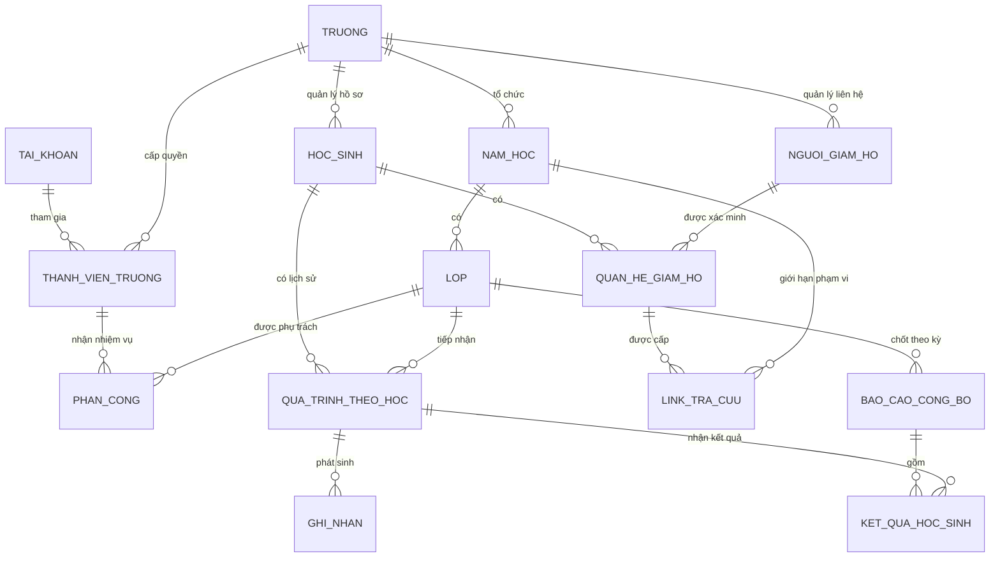

# PHƯƠNG ÁN NGHIỆP VỤ — NỀN TẢNG QUẢN LÝ NHÀ TRƯỜNG VÀ LỚP HỌC

**Sản phẩm xây mới hoàn toàn — Bản nghiệp vụ để khách hàng và đội phát triển cùng hiểu**  
**Phiên bản:** 2.0 — Thiết kế độc lập  
**Trạng thái:** Đề xuất nghiệp vụ, chưa phải phần mềm đã triển khai. Tên người, tên trường và số liệu trong các ví dụ đều là giả định.

> **Chủ nền tảng mở không gian cho từng trường → Nhà trường tổ chức và phân công → Giáo viên làm việc trong lớp được giao → Phụ huynh xem thông tin đã công bố của con.**

---

## 1. Chốt lại: chúng ta xây sản phẩm gì?

Xây một sản phẩm dùng chung cho nhiều trường. Mỗi trường có khu vực quản lý, nhân sự, lớp học và dữ liệu riêng. Thêm trường mới bằng thao tác quản trị, không làm một website riêng từ đầu cho từng trường.

Điểm trung tâm của sản phẩm là **“Lớp học của tôi”**. Giáo viên mở một lớp và tìm thấy toàn bộ công việc liên quan, thay vì phải đi qua hàng chục màn hình quản trị rời rạc.

| Điều giữ lại ở mức ý tưởng chức năng | Điều không kế thừa |
|---|---|
| Quản lý học sinh, tổ, chức vụ, sơ đồ lớp. | Code, cách chia file, giao diện hoặc công nghệ của hệ thống trước. |
| Nội quy, cộng/trừ điểm, xếp loại, khóa và chốt kỳ. | Cấu trúc lưu dữ liệu, tài khoản, mật khẩu hoặc cách phân quyền cũ. |
| Thời khóa biểu, trực nhật, hoạt động và minh chứng. | Tên trường, tên lớp, danh sách học sinh mẫu hoặc công thức cố định của một lớp. |
| Tra cứu cho phụ huynh, thông báo và báo cáo. | Yêu cầu bắt buộc chuyển dữ liệu từ hệ thống trước. |

**Phạm vi cố định:** không thanh toán; không gói cước; không đăng ký nhân sự tự do; phụ huynh không có tài khoản và chỉ xem. Việc nhập danh sách từ Excel là chức năng bình thường của sản phẩm mới, không phải phụ thuộc dữ liệu cũ.

**Phạm vi đề xuất:** tập trung quản lý vận hành lớp học. Chưa biến dự án thành phần mềm kế toán, tuyển sinh, thư viện, học trực tuyến hoặc học bạ chính thức.

## 2. Nhìn toàn bộ hệ thống qua 4 khu vực

```text
                  CHỦ NỀN TẢNG
                Tạo và quản lý các trường
                         │
            ┌────────────┴────────────┐
            ▼                         ▼
       NHÀ TRƯỜNG A              NHÀ TRƯỜNG B
       Dữ liệu riêng             Dữ liệu riêng
            │                         │
      Phân công giáo viên       Phân công giáo viên
            │                         │
       CÁC LỚP CỦA A             CÁC LỚP CỦA B
            │                         │
     Công bố thông tin con     Công bố thông tin con
            ▼                         ▼
       PHỤ HUYNH A               PHỤ HUYNH B
```

| Khu vực | Ai sử dụng? | Câu hỏi giao diện phải trả lời |
|---|---|---|
| **1. Vận hành nền tảng** | Chủ hệ thống. | Có những trường nào? Trường nào đang hoạt động? Ai quản trị từng trường? |
| **2. Quản lý nhà trường** | Quản trị trường, ban giám hiệu, giáo vụ theo quyền. | Trường có bao nhiêu lớp? Ai phụ trách? Lớp nào chưa hoàn thành công việc? |
| **3. Lớp học của tôi** | Giáo viên chủ nhiệm, giáo viên bộ môn. | Hôm nay tôi cần làm gì, ở lớp nào? |
| **4. Tra cứu của phụ huynh** | Người được nhà trường cấp đường dẫn riêng. | Con tôi học thế nào? Hôm nay có gì cần lưu ý? |

**Ví dụ:** Hai trường đều có lớp 10A1. Cô Lan thuộc trường A không thể mở 10A1 của trường B. Không có danh sách học sinh dùng chung để các trường tự tra cứu nhau.

## 3. Khu vực 1 — Chủ nền tảng quản lý các trường

### Công việc của người vận hành

Tạo trường, điền thông tin liên hệ và nhận diện; cấp quyền cho quản trị trường đầu tiên; kích hoạt hoặc tạm dừng trường; theo dõi tình trạng vận hành và hỗ trợ khi được trường cho phép.

```text
Danh sách trường → Thêm trường → Chỉ định quản trị trường → Kích hoạt
```

**Ví dụ:** Trường Minh Đức bắt đầu sử dụng. Cường tạo “Trường Minh Đức”, chỉ định cô Hạnh làm quản trị trường. Từ đó cô Hạnh tự tổ chức giáo viên và lớp trong trường mình.

### Màn hình chính

| Màn hình | Nội dung chính |
|---|---|
| Danh sách trường | Tên, trạng thái, đầu mối liên hệ, người quản trị. |
| Hồ sơ trường | Nhận diện, thông tin công khai, cấu hình được phép. |
| Quản trị trường | Mời người quản trị, thay người phụ trách, thu hồi quyền. |
| Hỗ trợ và vận hành | Yêu cầu hỗ trợ, lịch sử thao tác, sao lưu/khôi phục theo quy trình. |

Không có menu doanh thu, gói thuê bao, thanh toán hoặc công nợ. “Tạm dừng” là thao tác quản lý vận hành, không phải do chưa trả tiền. Tạm dừng không xóa dữ liệu; việc bàn giao/xuất dữ liệu cần được ủy quyền.

**Ranh giới quyền:** tài khoản vận hành không mặc định được xem và sửa toàn bộ điểm, hồ sơ gia đình của mọi trường. Khi hỗ trợ dữ liệu, trường cấp phạm vi và thời hạn rõ ràng, có lịch sử truy cập.

## 4. Khu vực 2 — Nhà trường tổ chức người và lớp

### 4.1. Quy trình đầu năm

```text
Tạo năm học
    → Tạo khối và lớp
    → Thêm giáo viên
    → Nhập danh sách học sinh
    → Phân công chủ nhiệm / bộ môn
    → Thiết lập nội quy và lịch
    → Cho các lớp bắt đầu sử dụng
```

Không bắt buộc phải xong toàn trường mới cho một lớp dùng thử. Lớp đã đủ thông tin và phân công có thể được kích hoạt trước.

### 4.2. Nhà trường quản lý những gì?

| Nhóm công việc | Nghiệp vụ | Ví dụ |
|---|---|---|
| **Năm học và lớp** | Tạo năm học, khối, lớp; số tuần, học kỳ, lịch nghỉ. | Năm học mới có 10A1, 10A2, 11A1. |
| **Giáo viên và phân công** | Mời/cấp tài khoản; giao chủ nhiệm, môn và lớp; thay người phụ trách. | Cô Lan chủ nhiệm 10A1; thầy Hùng dạy Toán 10A1 và 10A2. |
| **Học sinh và gia đình** | Nhập danh sách, đối chiếu trùng, xếp lớp, chuyển lớp; xác nhận người giám hộ. | Hai học sinh trùng tên vẫn được quản lý riêng. |
| **Nội quy và quy trình** | Ban hành nội quy, điểm cộng/trừ, hạn nhập, ai được chốt và công bố. | Mỗi trường thiết lập cách tính thi đua của mình. |
| **Lịch và thông báo** | Lịch trường, thời khóa biểu, thông báo toàn trường hoặc khối/lớp. | Nghỉ học ngày thứ Sáu; chỉ gửi đến đúng nhóm liên quan. |
| **Theo dõi và báo cáo** | Tình hình chuyên cần, thi đua, lớp chưa chốt, việc cần xử lý. | Ba lớp chưa hoàn thành báo cáo tuần. |

### 4.3. Không phải cán bộ nào cũng có toàn quyền

Đề xuất ba mẫu quyền dễ chọn: **Quản trị trường**, **Ban giám hiệu**, **Giáo vụ**. Trường quy mô nhỏ có thể để một người kiêm nhiệm; trường lớn chia người phụ trách. Quyền xem, nhập, phân công, công bố và xuất dữ liệu có thể được giao khác nhau.

Nhà trường cấp quyền bằng thao tác dễ hiểu: **Chọn người → Chọn nhiệm vụ → Chọn phạm vi → Chọn thời gian hiệu lực**.

**Ví dụ:** Giáo vụ được cập nhật hồ sơ và xếp lớp, nhưng không tự sửa một bảng thi đua đã công bố.

## 5. Khu vực 3 — Giáo viên làm việc trong “Lớp học của tôi”

### 5.1. Trang đầu của giáo viên

```text
LỚP HỌC CỦA TÔI

[10A1 — Chủ nhiệm]    [10A2 — Môn Toán]

VIỆC CẦN LÀM
Chưa điểm danh 10A1 · 3 ghi nhận chờ kiểm tra · Báo cáo tuần chưa chốt
```

Cùng một giáo viên nhưng khi mở mỗi lớp sẽ thấy các chức năng phù hợp với nhiệm vụ tại lớp đó. Không dùng một quyền “giáo viên” chung cho tất cả lớp.

### 5.2. Khi mở một lớp

```text
LỚP 10A1 · NĂM HỌC ĐANG CHỌN
Giáo viên chủ nhiệm · Sĩ số · Tuần hiện tại

Tổng quan | Học sinh | Điểm danh | Thi đua
Lịch lớp  | Tổ & sơ đồ | Hoạt động | Thông báo | Báo cáo
```

Đây là sơ đồ nhóm chức năng, không bắt buộc hiển thị tất cả thành một hàng tab dài trên điện thoại. Trên điện thoại, ưu tiên các việc thường dùng và đặt phần còn lại trong menu của lớp.

### 5.3. Các nhóm chức năng trong lớp

| Nhóm | Giáo viên thực hiện | Kết quả |
|---|---|---|
| **Tổng quan** | Xem việc cần làm, sĩ số, vắng học, việc chưa duyệt và hạn chốt. | Không phải tự mở từng mục để tìm việc còn thiếu. |
| **Học sinh** | Xem hồ sơ; cập nhật phần được phép; người giám hộ; đề nghị chuyển lớp. | Thông tin học sinh có đầu mối, có lịch sử. |
| **Điểm danh** | Đánh dấu có mặt, vắng có phép, vắng không phép, đi muộn; sửa trước khi chốt. | Biết tình hình chuyên cần từng ngày. Không coi “chưa điểm danh” là “có mặt”. |
| **Thi đua** | Ghi nhận khen thưởng/vi phạm; kiểm tra, điều chỉnh có lý do; chốt theo kỳ. | Bảng thi đua giải thích được từng lần cộng/trừ. |
| **Lịch lớp** | Xem/cập nhật theo quyền: thời khóa biểu, đổi tiết, lịch nghỉ, trực nhật. | Phụ huynh có lịch đã được công bố. |
| **Tổ và sơ đồ** | Xếp tổ, chức vụ, bố trí chỗ ngồi, đổi chỗ có ngày hiệu lực. | Biết học sinh thuộc tổ nào, phụ trách việc gì. |
| **Hoạt động** | Tạo hoạt động, hạn nộp, ghi nhận minh chứng nhận được, duyệt. | Biết ai chưa nộp, ai đã nộp, ai cần bổ sung. |
| **Thông báo** | Soạn nội dung cho lớp hoặc một học sinh; xem trước; công bố. | Đúng người xem được đúng thông tin. |
| **Báo cáo** | Xem và xuất báo cáo cá nhân/lớp theo tuần, tháng, kỳ hoặc năm. | Có bản rõ ràng để làm việc với nhà trường và phụ huynh. |

**Điểm danh độc lập** là chức năng bổ sung được đề xuất cho sản phẩm mới. Khi liên kết với thi đua, cùng một sự việc không được trừ điểm hai lần vì vừa điểm danh vừa nhập thi đua.

**Chức vụ học sinh không phải quyền tài khoản.** Lớp trưởng, tổ trưởng vẫn được quản lý và có thể có điểm cộng theo nội quy, nhưng bản đầu không cấp tài khoản nhập liệu cho học sinh, không dùng mật khẩu chung cho tổ.

### 5.4. Phân biệt chủ nhiệm với giáo viên bộ môn

| Tình huống | Cô Lan — chủ nhiệm 10A1 | Thầy Hùng — dạy Toán 10A1 |
|---|---|---|
| Xem danh sách học sinh | Có. | Có, thông tin cần thiết cho việc dạy. |
| Xếp tổ, đổi sơ đồ lớp | Có, theo phân công. | Không mặc định. |
| Xem/cập nhật người giám hộ | Theo quyền hồ sơ được giao. | Không mặc định. |
| Ghi nhận một việc xảy ra trong tiết học | Có. | Có, trong lớp/tiết thuộc nhiệm vụ. |
| Chốt thi đua toàn lớp | Có nếu trường giao quyền. | Không mặc định. |
| Phát hành link phụ huynh | Có nếu được giao quyền và người nhận đã xác minh. | Không mặc định. |
| Sửa kết quả môn học | Chỉ khi được phân công/ủy quyền môn đó. | Chỉ môn Toán của lớp được giao, khi module này được triển khai. |

## 6. Khu vực 4 — Phụ huynh xem thông tin của con

### 6.1. Không có tài khoản phụ huynh

Không có màn hình đăng ký, mật khẩu tài khoản, quên mật khẩu hoặc khu vực quản trị cho phụ huynh.

```text
Giáo viên xác nhận người được nhận thông tin
    → Cấp đường dẫn / QR riêng
    → Gửi riêng cho phụ huynh
    → Phụ huynh mở
    → Xem thông tin của con đã được công bố
```

**Ví dụ:** Mẹ em Minh Anh mở link của Minh Anh và xem lịch học, chuyên cần, thi đua cùng thông báo liên quan. Không có danh sách cả lớp để chuyển sang xem một bạn khác.

### 6.2. Trang phụ huynh nên thật đơn giản

```text
THÔNG TIN CỦA MINH ANH
Lớp 10A1 · Trường Minh Đức · Năm học đang xem

[Cần lưu ý]       [Lịch học hôm nay]
[Chuyên cần]      [Thi đua đã công bố]
[Hoạt động]       [Giáo viên và liên hệ]

Cập nhật gần nhất: thời điểm thông tin được công bố
```

Ưu tiên điện thoại, chữ dễ đọc, lịch theo ngày và kết quả theo tuần. “Chưa công bố” phải hiển thị đúng là chưa có kết quả; không tự hiện 0 điểm hoặc báo không có vi phạm.

Không lấy ảnh thiết kế trước làm yêu cầu phải có tên/tài khoản phụ huynh trên góc màn hình. Không thêm nút chat, gửi đơn hoặc tải minh chứng lên khi phạm vi chỉ là xem. Có thể hiển thị kênh liên hệ công việc do nhà trường cho phép.

### 6.3. Phụ huynh thấy gì và không thấy gì?

| Được xem khi đã công bố | Không được xem |
|---|---|
| Thông tin tối thiểu về chính con. | Hồ sơ, điểm hoặc số điện thoại của các gia đình khác. |
| Giáo viên phụ trách và liên hệ được phép chia sẻ. | Thông tin cá nhân nội bộ của giáo viên. |
| Lịch học, lịch nghỉ, nhiệm vụ của con. | Ghi chú nội bộ, dự thảo hoặc lịch chưa công bố. |
| Chuyên cần, thi đua, nhận xét dành cho con. | Bảng xếp hạng có tên/điểm đầy đủ của cả lớp. |
| Thông báo và tình trạng hoạt động của con. | Ảnh/minh chứng của bạn khác hoặc tệp chưa được phép chia sẻ. |
| Kết quả học tập của con nếu trường bật module và công bố. | Sổ điểm đang nhập, kết quả chưa chốt. |

**Trang công khai của trường** là trang khác: chỉ giới thiệu, địa chỉ, liên hệ chính thức và thông báo công khai. Không chứa công cụ tự do chọn học sinh để xem dữ liệu cá nhân.

### 6.4. Đường dẫn riêng giống một chiếc chìa khóa

Ai được chuyển tiếp đường dẫn còn hiệu lực có thể dùng quyền xem của đường dẫn đó. Vì vậy không nói rằng hệ thống đã xác minh chắc chắn danh tính người đang xem chỉ vì họ mở link.

Mỗi người giám hộ có thể được cấp một link riêng; có hạn dùng, mục được xem và nút thu hồi. Link được gửi riêng, không đưa vào nhóm chung. Mất link thì thu hồi và cấp lại. Một người có hai con dùng hai link ở bản đầu; không tự ghép gia đình dựa trên số điện thoại.

Quyền tra cứu mặc định giới hạn trong **một học sinh, một trường và một năm học**. Đổi lớp trong cùng trường/năm học vẫn chỉ liên quan chính học sinh đó; đổi trường hoặc sang năm học mới phải được trường cấp quyền phù hợp, không tự mở rộng sang trường/năm khác.

Thu hồi phải chặn các lần xem/tải mới, kể cả trên trang đang mở. Không thể thu hồi ảnh chụp màn hình hoặc bản mà người xem đã tải/lưu trước đó. Nếu trường cần xác minh người xem mạnh hơn, đó là yêu cầu bổ sung phải chốt riêng, không âm thầm thêm đăng nhập vào bản này.

## 7. Quy trình nghiệp vụ quan trọng nhất: từ giáo viên đến phụ huynh

### 7.1. Thi đua theo tuần

```text
GHI NHẬN
Giáo viên lưu một sự việc có học sinh, ngày, nội dung, người ghi
    ↓
RÀ SOÁT
Chủ nhiệm kiểm tra, loại trùng, yêu cầu bổ sung hoặc điều chỉnh
    ↓
CHỐT VÀ CÔNG BỐ
Người được trường giao quyền xác nhận bảng tuần
    ↓
PHỤ HUYNH XEM
Chỉ thấy kết quả đã công bố của chính con
```

Bản mặc định cho phép chủ nhiệm được ủy quyền chốt và công bố lớp mình. Không bắt mọi thông báo hoặc ghi nhận nhỏ đi qua ban giám hiệu. Trường có thể chọn quy trình thêm người duyệt cho báo cáo quan trọng.

### 7.2. Minh họa một tuần thực tế

| Thời điểm | Ai làm gì? | Phụ huynh thấy gì? |
|---|---|---|
| Thứ Hai | Cô Lan điểm danh, ghi nhận Minh Anh đi muộn; minh họa nội quy trừ 5 điểm. | Chuyên cần nếu đã công bố; bảng thi đua tuần chưa chốt chưa thành kết quả chính thức. |
| Thứ Tư | Thầy Hùng ghi nhận Minh Anh tích cực phát biểu; minh họa cộng 2 điểm. | Chưa tự công khai ghi nhận đang chờ rà soát. |
| Cuối tuần | Cô Lan kiểm tra và chốt: 100 − 5 + 2 = 97 điểm. | Xem 97 điểm cùng giải thích các lần cộng/trừ được phép chia sẻ. |
| Sau công bố | Phát hiện ghi nhận đi muộn nhầm học sinh; cô Lan đề nghị điều chỉnh. | Bản 97 điểm vẫn là bản đang công bố trong lúc chờ xử lý. |
| Khi điều chỉnh được duyệt | Hệ thống lưu bản sửa mới, người sửa và lý do, rồi công bố lại. | Xem bản mới và ghi chú đã điều chỉnh; không âm thầm thay số. |

**Các điểm số chỉ để minh họa phép tính.** Điểm gốc, điểm cộng/trừ, giới hạn và xếp loại do trường thiết lập. Không dùng ví dụ này làm công thức bắt buộc. Điểm thi đua không tự biến thành kết quả học lực hoặc rèn luyện chính thức.

### 7.3. Thông báo và lịch học

```text
Soạn / Chỉnh lịch → Xem trước → Công bố đúng trường, lớp hoặc học sinh
```

Thông báo cá nhân chỉ xuất hiện với học sinh được chỉ định. Lịch đổi tiết phải có ngày hiệu lực; không thay lịch tuần trước để khớp tuần sau. Thông báo thu hồi phải dừng hiển thị ở các lần tải mới, nhưng không thể xóa bản người xem đã lưu.

### 7.4. Hoạt động và minh chứng

```text
Tạo hoạt động và hạn hoàn thành
    → Giao cho lớp / nhóm học sinh
    → Giáo viên ghi nhận bài và minh chứng nhận được
    → Duyệt / yêu cầu bổ sung
    → Công bố tình trạng liên quan đến từng học sinh
```

Bản đầu, phụ huynh chỉ xem. Giáo viên nhập/tải minh chứng đã nhận qua kênh ngoài hoặc trực tiếp tại trường. Thu bài trực tuyến từ học sinh/phụ huynh là phạm vi mở rộng sau. Hoàn thành hoạt động không tự cộng điểm thi đua nếu chưa có nội quy và liên kết được duyệt.

## 8. Khi nào cần lưu, khi nào cần công bố?

| Hành động | Ý nghĩa với người dùng |
|---|---|
| **Lưu nháp** | Công việc đã được lưu cho người có quyền xử lý; phụ huynh chưa thấy. |
| **Công bố** | Cho phép đúng người xem nội dung đã được duyệt/chấp thuận theo quy trình của trường. |
| **Chốt kỳ** | Khóa việc sửa trực tiếp dữ liệu kỳ đó; ghi nhận muộn phải đi qua xử lý điều chỉnh. |
| **Điều chỉnh sau chốt** | Nêu lý do, người chịu trách nhiệm, lưu bản trước và bản sau; công bố lại khi được duyệt. |

Với báo cáo thi đua, giao diện có thể gộp thành nút **“Chốt và công bố”** khi người thao tác đủ quyền. Với thông báo thường, chỉ cần soạn và công bố. Không tạo thêm bước duyệt hình thức cho mọi thao tác.

**Điểm quan trọng:** thành công “Đã lưu” phải có nghĩa dữ liệu đã lưu thật. Mất kết nối phải báo chưa lưu/chờ xử lý, không báo thành công giả rồi khiến giáo viên tưởng đã hoàn tất.

## 9. Những tình huống phải thiết kế ngay từ đầu

| Tình huống | Cách xử lý nghiệp vụ |
|---|---|
| Hai học sinh trùng tên | Phân biệt bằng mã hồ sơ riêng; không gộp chỉ vì giống tên. |
| Nhập Excel có dòng lỗi | Xem trước, báo đúng dòng lỗi, cho sửa; không âm thầm xóa/thay danh sách đang có. |
| Hai giáo viên cùng sửa | Phát hiện nội dung đã đổi, yêu cầu xem lại; không ghi đè âm thầm. |
| Cùng một sự việc được nhập hai nơi | Cảnh báo và liên kết để không trừ/cộng hai lần. |
| Học sinh chuyển từ 10A1 sang 10A2 | Lưu ngày chuyển, kết thúc lớp cũ, bắt đầu lớp mới; giữ lịch sử, không đổi lớp cho toàn bộ báo cáo quá khứ. |
| Thay giáo viên chủ nhiệm | Bàn giao lớp và việc đang xử lý; thu hồi quyền lớp của giáo viên cũ; giữ tên người đã tạo dữ liệu lịch sử. |
| Một giáo viên thuộc hai trường | Quyền mỗi trường độc lập. Trường A không được đổi mật khẩu chung hoặc xóa quyền ở trường B. |
| Phụ huynh làm lộ link | Thu hồi link liên quan, chặn lần xem mới, cấp lại; không làm mất quyền của người giám hộ khác. |
| Hết năm học | Lưu trữ năm cũ; tạo lớp và phân công năm mới; xác nhận lên lớp/lưu ban/chuyển trường, không tự tăng lớp cho mọi học sinh. |
| Đổi nội quy giữa kỳ | Bản mới có ngày hiệu lực; kết quả đã công bố không tự tính lại. |
| Trường ngừng sử dụng | Dừng truy cập theo quyết định, giữ dữ liệu theo quy trình lưu giữ và bàn giao đã chốt; không xóa tự động vì trạng thái trường. |
| Muốn bỏ một học sinh có lịch sử | Dùng trạng thái chuyển đi/ngừng theo học; việc xóa dữ liệu cá nhân phải theo quy trình riêng, không xóa kéo theo mọi báo cáo. |

## 10. Menu gợi ý: mỗi người chỉ thấy phần việc của mình

| Chủ nền tảng | Nhà trường | Giáo viên | Phụ huynh |
|---|---|---|---|
| Tổng quan | Tổng quan trường | Việc cần làm | Tổng quan của con |
| Trường học | Năm học và lớp | Lớp học của tôi | Lịch học |
| Quản trị trường | Giáo viên và phân công | Lịch dạy | Chuyên cần |
| Hỗ trợ | Học sinh và gia đình | Thông báo | Thi đua |
| Vận hành | Nội quy và lịch | Báo cáo được phép | Hoạt động |
| Nhật ký | Báo cáo và công bố | Tài khoản cá nhân | Giáo viên liên hệ |

Trong khu vực nhà trường còn có thông báo, quyền truy cập phụ huynh và cài đặt; quyền người dùng quyết định mục nào được hiện. Trong khu vực giáo viên, các nghiệp vụ chi tiết được đặt **bên trong từng lớp**, không lặp nguyên menu toàn trường.

**Nguyên tắc giao diện:** luôn thấy trường, năm học và lớp đang thao tác; có lọc và tìm kiếm; màn hình trống có hướng dẫn; trạng thái chờ duyệt/đã chốt/đã công bố có chữ rõ ràng; không chỉ phân biệt bằng màu.

## 11. Sơ đồ dữ liệu ở mức nghiệp vụ — chưa chốt số bảng

Không bắt đầu bằng câu hỏi “cần 63 hay 80 bảng”. Trước tiên xác định những đối tượng và quan hệ mà người sử dụng hiểu được.

```text
TRƯỜNG
├── NĂM HỌC → LỚP → QUÁ TRÌNH THEO HỌC ← HỌC SINH
├── THÀNH VIÊN TRƯỜNG ← TÀI KHOẢN GIÁO VIÊN
│   └── PHÂN CÔNG → LỚP / MÔN / THỜI GIAN
└── NỘI QUY VÀ QUY TRÌNH CÔNG BỐ

HỌC SINH
├── LỊCH SỬ THEO HỌC → lớp, năm học, ngày bắt đầu/kết thúc
├── QUAN HỆ NGƯỜI GIÁM HỘ → quyền nhận thông tin → link tra cứu
└── GHI NHẬN → chuyên cần, thi đua, hoạt động

LỚP
├── LỊCH HỌC / TỔ / CHỨC VỤ / SƠ ĐỒ
├── HOẠT ĐỘNG → MINH CHỨNG
├── THÔNG BÁO → phạm vi người được xem
└── BÁO CÁO ĐÃ CÔNG BỐ → kết quả riêng cho từng học sinh
```

| Đối tượng | Hiểu đơn giản | Điều cần nhớ |
|---|---|---|
| Trường | Một đơn vị sử dụng sản phẩm. | Không lẫn dữ liệu với trường khác. |
| Năm học | Một giai đoạn quản lý. | Năm trước không bị ghi đè khi mở năm mới. |
| Lớp | Lớp của một năm học cụ thể. | 10A1 năm nay khác 10A1 năm sau. |
| Tài khoản và thành viên trường | Một người đăng nhập, được một trường cho phép làm việc. | Xóa quyền ở một trường khác với khóa tài khoản toàn hệ thống. |
| Phân công | Ai làm việc gì ở lớp/môn nào, từ khi nào. | Quyền không tự lan sang lớp khác. |
| Học sinh và quá trình theo học | Một hồ sơ và các giai đoạn em theo học trong trường. | Chuyển lớp không mất lịch sử. Không tự chia sẻ hồ sơ giữa các trường. |
| Người giám hộ | Người trường xác nhận được nhận thông tin. | Có thể có nhiều người nhận, không nhất thiết có tài khoản. |
| Đường dẫn tra cứu | Quyền xem có phạm vi và hạn dùng. | Không phải hồ sơ đăng nhập phụ huynh. |
| Ghi nhận | Một việc xảy ra, có người tạo và thời điểm. | Có thể giải thích nguồn của một điểm cộng/trừ. |
| Báo cáo công bố | Bản thông tin được xác nhận để chia sẻ. | Giữ bản trước khi có điều chỉnh. |

### Sơ đồ quan hệ để đội phát triển trao đổi

Đây là **sơ đồ khái niệm**, không phải database vật lý đầy đủ. Các đối tượng lịch, nội quy, tổ, hoạt động và thông báo được mô tả phía trên, sẽ được chi tiết hóa trong thiết kế dữ liệu sau khi chốt nghiệp vụ.



Mỗi quan hệ phải thuộc đúng trường. Một ghi nhận luôn gắn đúng học sinh/lớp/thời điểm xảy ra, không suy ra từ lớp hiện tại khi đọc báo cáo cũ. Số bảng, tên cột, khóa và công nghệ chưa được quyết định bởi sơ đồ này.

## 12. Chia triển khai thành 3 đợt có thể nghiệm thu

| Đợt | Làm gì? | Kết quả phải dùng được |
|---|---|---|
| **1 — Tổ chức và quyền** | Tạo trường, tài khoản, năm học, lớp, học sinh, người giám hộ; phân công và màn hình theo vai trò. | Dựng hai trường thử nghiệm, giáo viên chỉ thấy đúng lớp/môn; tạo/thu hồi được quyền. |
| **2 — Quản lý lớp và tra cứu** | Chuyên cần; nội quy/thi đua; chốt và công bố; lịch; thông báo; link phụ huynh; báo cáo cơ bản. | Một lớp vận hành trọn tuần: nhập → kiểm tra → công bố → phụ huynh xem đúng con. |
| **3 — Hoàn thiện vận hành** | Tổ, chức vụ, sơ đồ, trực nhật; hoạt động/minh chứng; báo cáo đầy đủ; bàn giao, chuyển lớp, kết thúc năm; kiểm thử vận hành và bảo vệ dữ liệu. | Bản nền tảng hoàn chỉnh trong phạm vi đã chốt, sẵn sàng đánh giá để đưa vào sử dụng thật. |

Phân quyền, lưu lịch sử và bảo vệ dữ liệu phải được làm từ đợt 1 và mở rộng theo từng chức năng; không chờ đợt 3 mới bổ sung. Có bản thử nghiệm không đồng nghĩa đã đủ điều kiện dùng dữ liệu thật của học sinh.

**Phần mở rộng sau bản nền tảng:** kết quả học tập theo môn/kỳ; AI hỗ trợ nhập thời khóa biểu; tài khoản học sinh; thu bài trực tuyến; gửi tin nhắn tự động qua dịch vụ bên ngoài. Chỉ thêm khi được chốt riêng. Module kết quả học tập phải thiết kế độc lập với thi đua, không chỉ đổi tên cột điểm.

## 13. Nghiệm thu bằng tình huống, không chỉ nhìn giao diện đẹp

| Mã | Thử nghiệm thực tế | Kết quả đúng |
|---|---|---|
| NV-01 | Tạo trường A và B, cùng tên lớp 10A1. | Dữ liệu không bị trộn; tài khoản A không truy cập dữ liệu B. |
| NV-02 | Cô Lan chủ nhiệm 10A1, dạy Toán 10A2. | Quản lý lớp 10A1; tại 10A2 chỉ có quyền môn Toán được giao. |
| NV-03 | Thu hồi quyền cô Lan tại 10A1 trong lúc cô đang mở lớp. | Các lần đọc/ghi tiếp theo của lớp bị chặn theo quyền đã thu hồi. |
| NV-04 | Giáo viên lưu thi đua nháp. | Người có quyền nội bộ thấy; phụ huynh chưa thấy kết quả chưa công bố. |
| NV-05 | Chốt và công bố tuần. | Phụ huynh mở link không đăng nhập và xem đúng bản đã công bố của con. |
| NV-06 | Thử chọn/đổi mã sang học sinh khác từ link phụ huynh. | Không được xem dữ liệu học sinh khác. |
| NV-07 | Thu hồi link phụ huynh. | Các lần truy cập mới bị chặn; link của người giám hộ khác vẫn theo trạng thái riêng. |
| NV-08 | Đổi công thức tuần mới. | Kết quả tuần đã công bố không tự thay đổi. |
| NV-09 | Điều chỉnh kết quả sau chốt. | Có lý do, quyền phê duyệt, bản trước và bản mới; không ghi đè mất dấu. |
| NV-10 | Nhập hai lần cùng sự việc hoặc bấm lưu lại do mạng chậm. | Không nhân đôi điểm; người nhập nhận được trạng thái rõ ràng. |
| NV-11 | Chuyển lớp và thay giáo viên. | Giữ đúng lịch sử; quyền giáo viên cũ/mới đúng thời gian và phạm vi. |
| NV-12 | Nhập Excel trùng tên hoặc có dòng sai. | Không gộp nhầm người; hiển thị lỗi, cho kiểm tra trước khi nhập. |
| NV-13 | Sang năm học mới. | Tạo lớp/phân công mới; năm cũ giữ bản báo cáo; quyền tra cứu được cấp phù hợp. |
| NV-14 | Tắt mạng khi lưu. | Không báo “Đã lưu” khi chưa lưu thành công. |
| NV-15 | Đọc bằng điện thoại. | Không cần tài khoản phụ huynh, không lộ danh sách cả lớp, đọc được nội dung và trạng thái. |

## 14. Chỉ dẫn cho đội thiết kế và lập trình

Bắt đầu từ bốn khu vực người dùng và luồng **một lớp vận hành trọn một tuần**. Thiết kế giao diện, cấu trúc dữ liệu và phân quyền mới từ yêu cầu nghiệp vụ này; không lấy hệ thống trước làm khuôn để thay giao diện.

Không lấy repo, code, bảng dữ liệu, cấu hình hay danh tính của hệ thống trước làm điều kiện triển khai. Không tự thêm migration dữ liệu cũ, thanh toán hoặc tài khoản phụ huynh. Khi cần dựng demo, dùng dữ liệu giả định, tách với môi trường thật.

Sau khi nghiệp vụ được duyệt, đội kỹ thuật mới lập thiết kế database chi tiết, tài liệu quyền và kế hoạch triển khai từng đợt. Mỗi đợt phải có kịch bản kiểm thử và demo quy trình thật; không nghiệm thu chỉ bằng số màn hình đã dựng.

**Tóm tắt để nói với khách:** “Mỗi trường có không gian riêng. Trường giao lớp và công việc cho giáo viên. Giáo viên mở lớp mình để quản lý hằng ngày và công bố kết quả. Phụ huynh mở link riêng để xem thông tin của con, không cần tài khoản. Toàn bộ sản phẩm được xây mới, không phụ thuộc phần mềm trước.”
